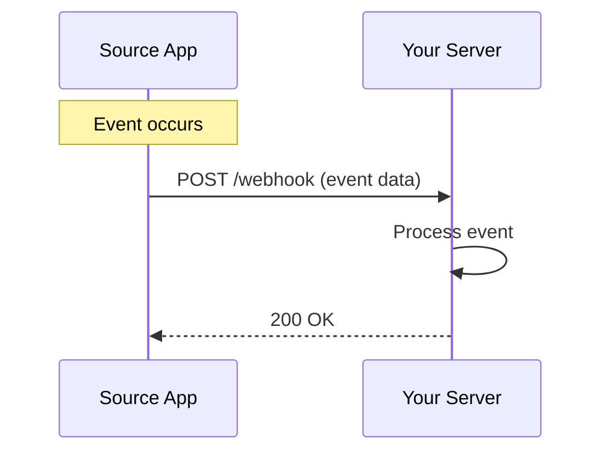

# Conceptual Documentation Sample

This document demonstrates how to explain complex technical concepts in an accessible way.

## Understanding Webhooks

Webhooks are a powerful way for applications to communicate with each other automatically when specific events occur.

### What is a Webhook?

A webhook is an HTTP callback - a simple event notification via HTTP POST. When something happens in a source system, the webhook sends data to a destination system in real-time.

Think of webhooks like notifications on your phone. Instead of constantly checking your phone to see if you have new messages (polling), your phone tells you immediately when a message arrives (webhook).

### How Webhooks Work

Here's the basic flow of a webhook:

1. **Event occurs** - Something happens in the source application (e.g., a user signs up, an order is placed, a file is uploaded)
2. **HTTP POST is triggered** - The source application sends an HTTP POST request to a pre-configured URL
3. **Destination receives data** - The destination application's server receives and processes the webhook payload
4. **Action is taken** - The destination application performs an action based on the received data



### Webhooks vs. Polling

There are two main ways for applications to get data from other systems: webhooks and polling.

#### Polling (The Old Way)

With polling, your application repeatedly asks "Do you have anything new for me?" at regular intervals.

**Disadvantages:**
- Wastes resources checking when nothing has changed
- Creates unnecessary network traffic
- May miss events between polling intervals
- Harder to scale with increased frequency

#### Webhooks (The Modern Way)

With webhooks, the source application notifies your application only when something happens.

**Advantages:**
- Real-time updates - no delay waiting for the next poll
- Efficient - only sends data when there's something to send
- Reduces server load - no constant checking required
- Scalable - handles high-frequency events naturally

### Anatomy of a Webhook

A typical webhook POST request contains:

#### Headers

```http
POST /webhooks/order-created
Host: your-app.com
Content-Type: application/json
X-Webhook-Signature: sha256=abc123...
X-Event-Type: order.created
```

#### Payload

```json
{
  "event": "order.created",
  "timestamp": "2026-01-24T14:30:00Z",
  "data": {
    "orderId": "ORD-12345",
    "customer": {
      "id": "CUST-789",
      "email": "customer@example.com"
    },
    "total": 149.99,
    "currency": "USD"
  }
}
```

### Security Considerations

Because webhooks accept HTTP requests from external sources, security is critical.

#### Verify Webhook Signatures

Always verify that webhook requests are genuine:

```javascript
const crypto = require('crypto');

function verifyWebhookSignature(payload, signature, secret) {
  const hmac = crypto.createHmac('sha256', secret);
  const digest = hmac.update(payload).digest('hex');
  return crypto.timingSafeEqual(
    Buffer.from(signature),
    Buffer.from(digest)
  );
}
```

#### Use HTTPS

Always use HTTPS endpoints for webhooks. HTTP endpoints expose sensitive data to interception.

#### Implement Replay Protection

Check the timestamp and reject old webhook deliveries:

```javascript
const MAX_WEBHOOK_AGE = 5 * 60 * 1000; // 5 minutes

function isWebhookExpired(timestamp) {
  const webhookTime = new Date(timestamp).getTime();
  const currentTime = Date.now();
  return (currentTime - webhookTime) > MAX_WEBHOOK_AGE;
}
```

### Handling Webhook Failures

Networks are unreliable, so webhook delivery can fail. Implement proper error handling:

#### Return the Right Status Codes

- **200-299**: Success - webhook processed successfully
- **400-499**: Client error - don't retry (bad data)
- **500-599**: Server error - retry with backoff

#### Implement Idempotency

Process each webhook only once, even if it's delivered multiple times:

```javascript
const processedWebhooks = new Set();

function processWebhook(webhookId, data) {
  if (processedWebhooks.has(webhookId)) {
    console.log('Duplicate webhook - already processed');
    return;
  }

  // Process the webhook
  handleData(data);

  // Mark as processed
  processedWebhooks.add(webhookId);
}
```

#### Queue for Processing

Don't process webhooks synchronously in the HTTP handler:

```javascript
app.post('/webhook', async (req, res) => {
  // Verify signature
  if (!verifySignature(req)) {
    return res.status(401).send('Invalid signature');
  }

  // Add to queue immediately
  await queue.add('process-webhook', req.body);

  // Respond quickly
  res.status(200).send('Webhook received');

  // Processing happens asynchronously
});
```

### Common Use Cases

Webhooks power many real-world integrations:

- **Payment Processing**: Stripe sends webhooks when payments succeed or fail
- **Deployment Pipelines**: GitHub sends webhooks when code is pushed, triggering CI/CD
- **Communication Tools**: Slack sends webhooks when messages are posted in channels
- **E-commerce**: Shopify sends webhooks when orders are created or inventory changes
- **CRM Systems**: Salesforce sends webhooks when leads are updated

### Best Practices

Follow these guidelines when implementing webhooks:

1. **Respond quickly** - Acknowledge receipt within 5 seconds, process asynchronously
2. **Handle retries gracefully** - Implement idempotency to handle duplicate deliveries
3. **Log everything** - Keep detailed logs for debugging failed deliveries
4. **Monitor webhook health** - Track delivery success rates and latency
5. **Version your webhooks** - Include version numbers in URLs or headers
6. **Document thoroughly** - Provide clear documentation on payload structure and events

### Further Reading

- [Webhook Best Practices Guide](#)
- [Implementing Webhook Security](#)
- [Debugging Webhook Issues](#)
- [Webhook Testing Tools](#)
